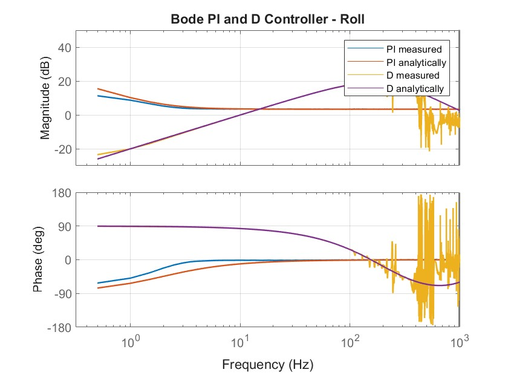

# Bode Plot Controller

This Plot is used as an inforamtion and verfication tool. It allows you to compares the analytically calculated PI and D controller to the measured ones. So you can check whether the analytical calculated controller matches the real system.

The deviation at the low frequencies is cause by the I-Term Relax, which intenionally modifies the I-component during fast stick movements. This is not included in the analytically calculation. So the calculated and measured PI response will be slightly different at the low frequencies.

At hight frequenciex, the difference come due the measurement errors like noice. In this range the data becomes less accurate, which is totally normal an not relevant for the tuning. The most important part is the middle part. There the measurment and the analytical PI should match. 

  

