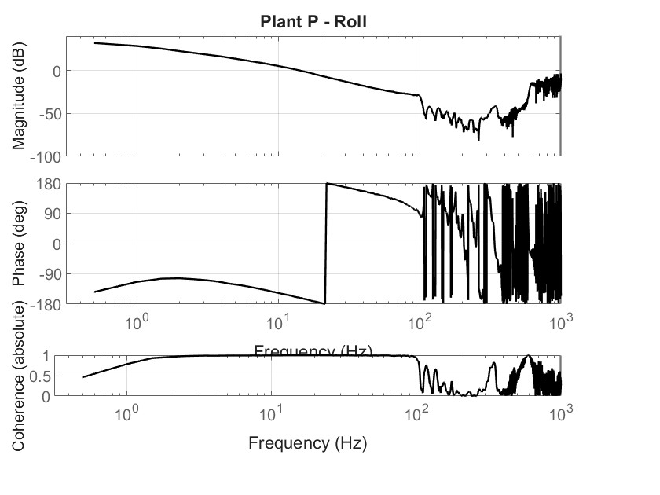

# Bode Plot Plant

The plant Bode plot mainly serves as an informational tool. It gives an overview of how well the physical system has been measured and how reliable the extracted plant model is. The magnitude and phase curves show whether the measurement behaves smoothly and follows the expected system dynamics, while the coherence curve is an indicator of measurement quality. High coherence means the data can be trusted, whereas low coherence suggests that noise or limitations in the logging make the results less meaningful in those frequency ranges.

Although other plots are more useful for actual tuning decisions, the plant Bode plot helps the user verify that the system identification worked correctly. It ensures that the controller is being tuned based on solid, trustworthy input data. In this sense, the plot is primarily used to check the validity and consistency of the measurement rather than to directly adjust gains or filter settings.
It's totally normal that the coherence get worse at a higher frequencys. Try to get to a good coherence until 500 Hz. You might get a bad coherence because of windy weather during the measurement flight.

  

