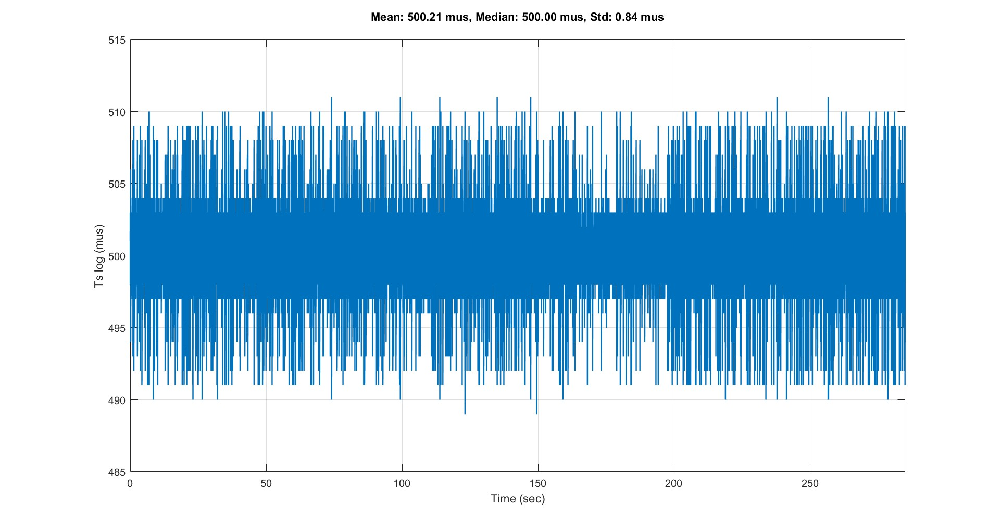

# Evolution Time Flight

This plot is important because it shows the timing accuracy of the flight controller during the entire flight. Each value represents the time difference between two logged samples, measured in microseconds. This allows you to see how stable and consistent the controller’s loop time is.
A stable loop time is essential, because :

- the PID controller only works correctly if the sampling time is constant
- variations in loop time can cause noise, oscillations, or unstable behaviour
- sudden spikes may indicate processor overload, logging delays, or sensor issues
- the standard deviation (Std) shows how much the timing fluctuates
- mean and median show whether the expected loop rate is actually achieved

## Recommended Values for Loop-Time Stability (Ts log)

### 1. Mean (Average Loop Time)
Depending on the loop frequency:

| Loop Frequency | Expected Mean |
|----------------|----------------|
| **1 kHz**      | ~ **1000 µs**  |
| **2 kHz**      | ~ **500 µs**   |
| **4 kHz**      | ~ **250 µs**   |
| **8 kHz**      | ~ **125 µs**   |

---

### 2. Median
- Should be almost identical to the mean  
- **Deviation < 0.2 µs** is normal  
- Large differences may indicate occasional spikes

---

### 3. Standard Deviation (Jitter)
| Std (µs) | Rating |
|---------|---------|
| **< 1 µs**   | excellent |
| **1–2 µs**   | very good |
| **2–5 µs**   | acceptable |
| **> 5 µs**   | noticeable jitter |
| **> 10 µs**  | CPU overload / timing problem |

---

### 4. Spike / Outlier Thresholds
- **< +3 µs** → perfect  
- **< +5 µs** → acceptable  
- **> +10 µs** → timing issue (CPU load, I/O delay)

---

  

