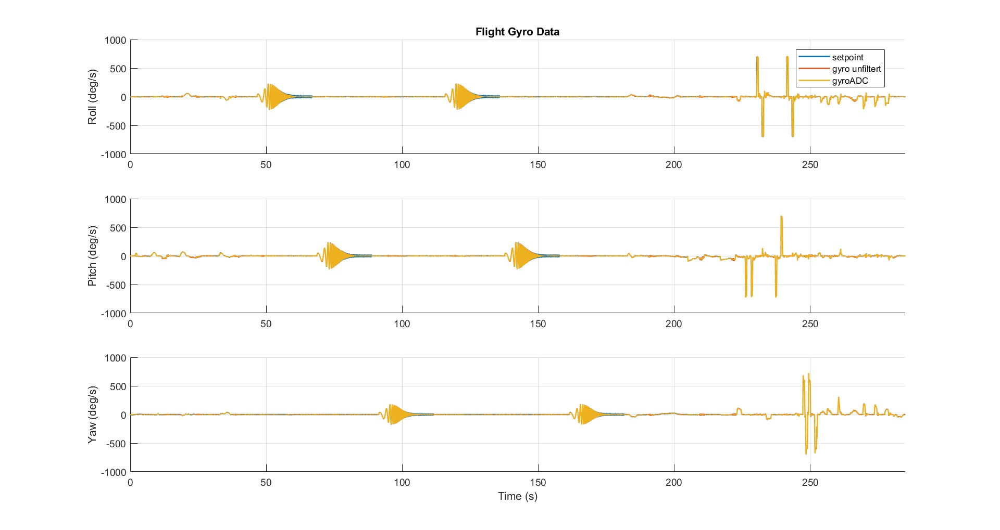

# Figure Flight Gyro Data

This plot shows the recorded gyro signals for the roll, pitch, and yaw axes. The plot also displays the controller setpoints, as well as the unfiltered and filtered gyro signals. This makes it possible to see any differences between the commanded values and the actual sensor data. In general, the plot mainly serves as an overview.

The chirp signals are also clearly visible (see [Chirp Signal](../Sinarg/Chirp.md) for more details). These chirp signals are used to excite the drone across a wide frequency range, showing how the system responds to different frequencies.

  

