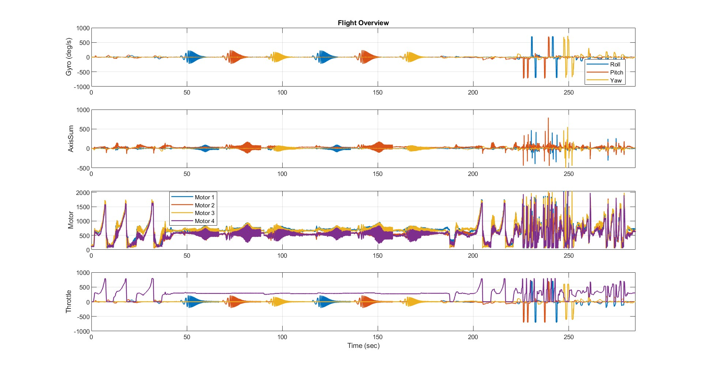

# Figure Flight Gyro Data

This figure provides an overview of the most important flight signals recorded during the test flight.

## Top subplot (Gyro)

The angular rates for Roll, Pitch, and Yaw are shown. You can clearly see the chirp patterns, where each axis is driven with a signal that slowly changes its frequency over time. These chirps help to see how the system reacts to different frequencies.

## Second subplot (AxisSum)

The combined axis response is shown, which illustrates how the three axes contribute to the overall rotational motion. From this plot, you can see how strongly the axes are coupled, meaning whether movement on one axis also affects the others. It also shows how disturbances spread through the system and whether the drone stays stable when multiple axes are active at the same time. In short, this plot helps to understand how cleanly the drone handles rotational movements and whether unwanted interactions occur between the axes.

## Third subplot (Motors):

This plot is important because it shows how much work the flight controller gives to each motor to keep the drone stable. By looking at the motor outputs, you can see whether the controller is working smoothly or if it has to react very strongly. This helps to find problems like motors reaching their limits, uneven power distribution, or a controller that is working too hard. Overall, the plot helps to understand how well the drone is tuned and how stable it is during the flight.

## Bottom subplot (Throttle)

This plot is important because it shows how the pilot’s throttle input affects the overall behaviour of the drone during the flight. By looking at the throttle curve, you can understand when the system needed more or less power and how the controller reacted to the changing conditions. It also helps to see whether the drone stays stable when the power changes quickly or when external disturbances occur. Overall, this plot is useful for evaluating how the drone handles different parts of the flight and how well the tuning supports stable and predictable behaviour.

  

