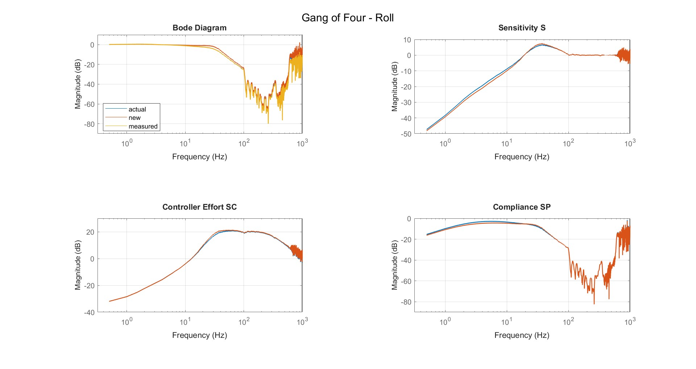

# Gang of four

The four Plots together describse actually the hole behavior of the control system of the drone. The plots will help you to evaluate stability, tracking performance, disturbance rejection and controller workload. Each plot highlights a different aspect of the system, so it is strongly recommended to work with all of them.

## Bode Diagram (T) Tracking / Closed Loop Response

**Purpose**:
This plot shows how well the controller follows the setpoint across frequency. Strong tracking at low frequencies means the drone holds its angle accurately. A roll-off at higher frequencies is necessary so the controller does not react to motor noise.

**How it helps tuning:**

- If the closed-loop gain is too low → increase P or I for sharper response.
- If tracking causes overshoot or oscillation → reduce P or increase D.
- If the curve falls off too early → controller is too weak → raise P.

**Goal**

- Stable at low frequencies (**0 dB**)
- Bandwith between **20-60 Hz**
- Strong noise suppression at high frequencies (**< -20 dB**)

## Sensitivity S – Disturbance Sensitivity & Stability Margin

**Purpose**:
The Sensitivity indicates us, how strong a system reacts to disturbances form outside. Low sensitivity means the controller surpreses this disturbances well, high sensitivity indicates indicates a more fragile system.
At high frequencies it is totally normal and expected that the Sensitivity approaches 0 dB. In this region the controller cannot react anymore, so disturbances are neither amplified nor activly surpessed.
A small overshoot in the middle frequencies range is also normal. As long as the peak does not is not higher than 6 dB, the system should be still stable. 

**How it helps tuning**.

- A strong peak $\rightarrow$ system near instability $\rightarrow$ reduce P or increase D
- A smooth, low sensitivity curve indicates stable and robust tuning.
- This plot shows how aggressively the system can be tuned before losing stability.

**Goal**

- Low sensitivity at low frequencies (strong disturbance rejection).
- Peak in the mid-frequency range stays below **6 dB**.
- Sensitivity returns smoothly toward **0 dB** at high frequencies (normal behavior).
  
## Controller Effort SC - Controller Workload

**Purpose:**
This plot shows how much corol activity the PI and D loop generates. Large values indicate heavy workload or that the controller is reacting strongly to noise, especially in the high-frequency range.

**How it helps tuning:**

- High controller effort at high frequencies $\rightarrow$ too much noise $\rightarrow$ increase D-term filtering.
- Excessive effort at mid frequencies $\rightarrow$ D too high, resulting in hot motors.
- A balanced controller effort curve shows efficient controller behavior.

**Goal**

- Controller effort stays within a moderate level **(±0–3 dB)** in the useful frequency rang
- Mid-frequency rise remains below **~6 dB** to prevent hot motors and excessive D-term activity.
- High-frequency controller effort drops to below **–20 dB** for effective noise suppression.

## Compliance SP – Disturbance Transmission / Flexibility

**Purpose:**
Compliance shows how much external disturbances pass through to the system output. Low values are desired; high values indicate that vibrations or external forces are not being rejected well.

**How it helps tuning**

- A peak in compliance reveals a frequency where disturbances pass through strongly $\rightarrow$ potential frame resonance or insufficient D-term.
- Broad elevation across frequencies → controller too soft → increase P or D.
- Filter effects can also be seen here; good filtering reduces compliance at high frequencies.

**Goal**

- Low compliance at low frequencies **(< –20 dB)** for strong disturbance rejection.
- Any mid-frequency peaks stay below **~6 dB** (avoids resonance amplification).
- Compliance continues to decrease toward high frequencies **(≤ –20 dB)** to prevent vibrations from passing through the system.

  

