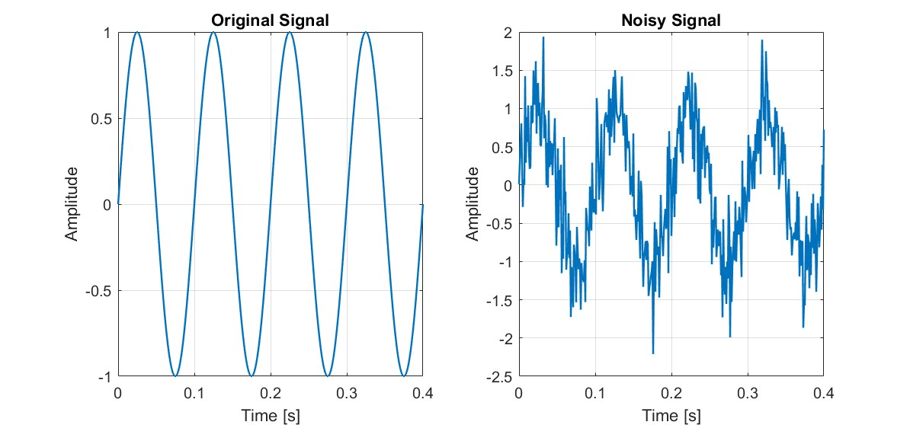
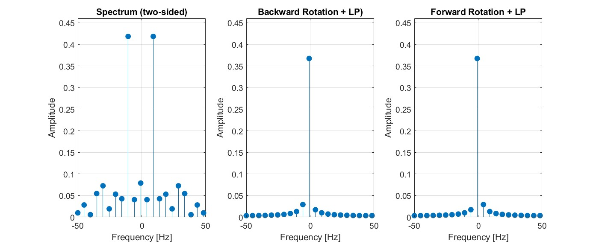
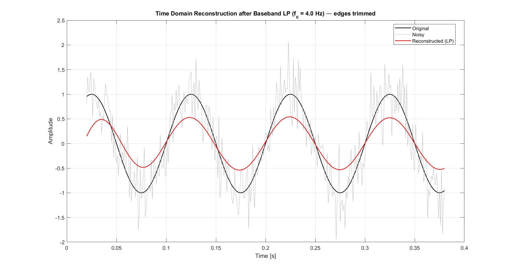

# Function `apply_rotfiltfilt`

The `apply_rotfiltfilt` function mathematically shifts the constantly changing frequency signal (the logarithmic chirp) so that it appears as a signal with a constant frequency.  
In this baseband, interfering unwanted signal components can be effectively removed with a low-pass filter without any time distortion.  
The filtered signal is then ‘shifted back’ to its original frequency curve.  
This results in a smoothed, phase-correct signal that contains the essential information of the original chirp but is free of noise and high-frequency interference components [1].

As an example, we consider a sine wave corrupted by noise which we will filter with the `apply_rotfiltfilt`.

  

---

## 1) Time-Dependent Phase Rotation (`sinarg`)

The function **`apply_rotfiltfilt`** uses a **time-dependent phasor**
$
p(t) = e^{i\,\text{sinarg}(t)},
$
where `sinarg` represents the **phase progression** of the carrier signal – for example, the phase of a **chirp** (a signal whose frequency changes continuously over time).  
`sinarg` is given in **radians** and can increase either **linearly** or **nonlinearly**, depending on the frequency behavior of the input signal [2][3].

By multiplying the input signal $x(t)$ with this phasor $p(t)$ or its complex conjugate $p^*(t)$, $$y_R(t) = x(t)\,p(t),$$ $$y_Q(t) = x(t)\,p^*(t),$$
the signal is mathematically **shifted in frequency**.  
You can imagine this as "rotating" the current carrier frequency of the signal down to **0 Hz (baseband)**.  
Once the signal is centered around 0 Hz, it becomes much easier and more precise to filter.

In mathematical terms, this corresponds to a **frequency shift**, as described by the well-known **Fourier relation**:
$e^{i2\pi\xi_0 t}\,f(t) \;\xleftrightarrow{\mathcal{F}}\; \hat{f}(\xi - \xi_0).$
The difference here is that $\xi_0$ is **not constant** — it changes **over time** [2][3].  
This means that the instantaneous frequency of the chirp is dynamically shifted to the baseband at every moment.

  

---

## 2) Forward Rotation and Baseband Filtering

After defining the phasor $p(t) = e^{i\,\text{sinarg}(t)}$, the next step is to **rotate the real signal** into the complex baseband. This is done by multiplying the signal $x(t)$ by both the phasor and its complex conjugate:

$$y_R(t) = x(t)\,p(t)$$
$$y_Q(t) = x(t)\,p^*(t)$$

These two rotated versions correspond to the **upper and lower sidebands** of the original signal. In this new representation, the rapidly oscillating carrier has been removed — what remains are slowly varying amplitude and phase components centered around **0 Hz**.

Once the signal resides in the baseband, a **zero-phase low-pass filter** can be applied without distorting its timing or phase relationships [4][5].  
In MATLAB, this is typically achieved using the `filtfilt` function, which applies the filter forward and backward in time.

  

---

## 3) Back-Rotation and Signal Reconstruction

After the filtering in the baseband, the signal is **rotated back** to its original frequency range.  
This is done by multiplying the filtered signals $y_R(t)$ and $y_Q(t)$ with their respective inverse phasors and then combining them back into a **real signal**:

$$x_f(t) = \text{Re}\left\{ \frac{1}{2}\big( y_R(t)\,p^*(t) + y_Q(t)\,p(t) \big) \right\}$$

This step reverses the previously applied frequency shift.  
The signal that was centered around 0 Hz during filtering is now “rotated back up” to follow its original carrier frequency trajectory.  
Since the filtering was performed with `filtfilt` (zero-phase), the result remains **time-aligned** and **phase-accurate** [1][2].

  

---

## References
[1] R. Pintelon, J. Schoukens, *System Identification: A Frequency Domain Approach*, 2nd ed., IEEE Press, 2012, **pp. 45–60.**  
[2] P. M. Djuric, S. M. Kay, *Statistical Digital Signal Processing and Modeling*, Prentice Hall, 1993, **pp. 25–35.**  
[3] R. Pintelon, J. Schoukens, *System Identification: A Frequency Domain Approach*, **pp. 110–130.**  
[4] P. M. Djuric, S. M. Kay, *Statistical Digital Signal Processing and Modeling*, **pp. 345–360.**  
[5] R. Pintelon, J. Schoukens, *System Identification: A Frequency Domain Approach*, **pp. 200–220.**
