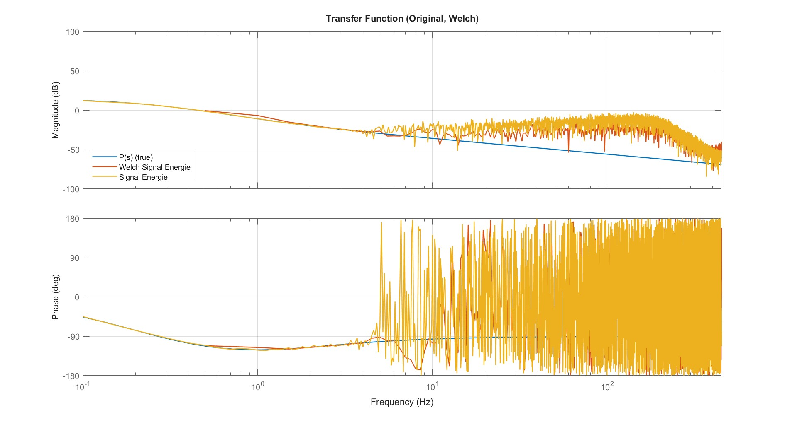

# Estimate Frequency Response

The `estimate_frequency_response` function estimates the **frequency response** and **coherence** between a measured input and output signal using the **Welch method** for spectral averaging [1][2].  
It returns an amplitude-calibrated, single-sided frequency response with correct phase and energy scaling.

As an example, consider a system excited by a random or chirp signal, where both input and output are measured to identify its linear dynamics.

  

---

## 1) Spectral Estimation and Theoretical Basis

### Derivation of the Frequency Response Formula

In the frequency domain, the relation between input and output of a linear time-invariant (LTI) system can be expressed as

$G(j\omega) = \frac{Y(j\omega)}{U(j\omega)},$

where $U(j\omega)$ and $Y(j\omega)$ are the Fourier transforms of the input $u(t)$ and output $y(t)$.  
This ratio describes how each frequency component of the input is scaled and phase-shifted by the system.

In practice, however, direct division of $Y(j\omega)$ and $U(j\omega)$ is sensitive to noise. 
To obtain a more reliable estimate, we use averaged spectral quantities:

$$S_{yu}(j\omega) = E\{Y(j\omega)U^*(j\omega)\}$$
$$S_{uu}(j\omega) = E\{|U(j\omega)|^2\}$$

which leads to the practical and statistically robust estimator
$G(f) = \frac{S_{yu}(j\omega)}{S_{uu}(j\omega)}.$

This formulation provides a consistent estimate of the system’s amplitude and phase response across all frequencies [1][2].

  

---

## 2) The Welch Method for Averaging

The function implements the **Welch averaging method** [1, pp. 356–364], which provides a smoother and statistically robust estimate by dividing the data into overlapping, windowed segments.

1. **Segmentation:**  
   The signals are divided into short overlapping sections of length $N_\text{est}$ with overlap.

2. **Windowing:**  
   Each segment is multiplied by a window (e.g. Hann) to reduce spectral leakage.

3. **FFT and normalization:**  
   Each windowed segment is transformed using the FFT and normalized by  
   $W = \sum w(n)/2$, ensuring correct amplitude calibration [1, p. 358].

4. **Power spectra formation:**  
   For each segment:
   
   $$S_{uu,k}(j\omega) = U_k(j\omega)U_k^*(j\omega)$$
   $$S_{yu,k}(j\omega) = Y_k(j\omega)U_k^*(j\omega)$$
   $$S_{yy,k}(j\omega) = Y_k(j\omega)Y_k^*(j\omega)$$
   
   The spectra are then converted to **one-sided** form by doubling all interior bins and dividing the DC and Nyquist bins by 4 [1, p. 360].

5. **Averaging:**  
   The spectra from all segments are averaged to yield $\overline{S}_{uu}, \overline{S}_{yu}, \overline{S}_{yy}$.

  

---

## 3) Regularization and Robustness

To avoid division by near-zero values of $S_{uu}(f)$, a small positive constant `delta` is added:
$$G(j\omega) = \frac{S_{yu}(j\omega)}{S_{uu}(j\omega) + \delta}$$
This **regularized spectral inversion** improves numerical stability [2, pp. 208–210].

---

## References

[1] P. M. Djuric, S. M. Kay, *Statistical Digital Signal Processing and Modeling*, Prentice Hall, 1993, **pp. 356–375.**  
[2] R. Pintelon, J. Schoukens, *System Identification: A Frequency Domain Approach*, 2nd ed., IEEE Press, 2012, **pp. 57–63, 205–212.**
