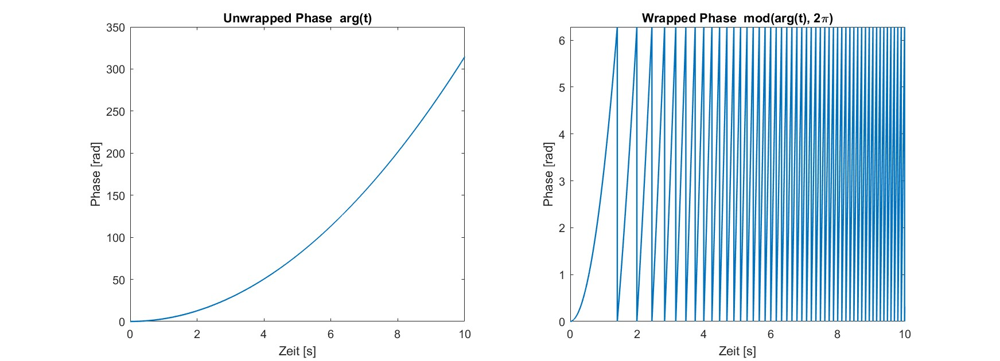
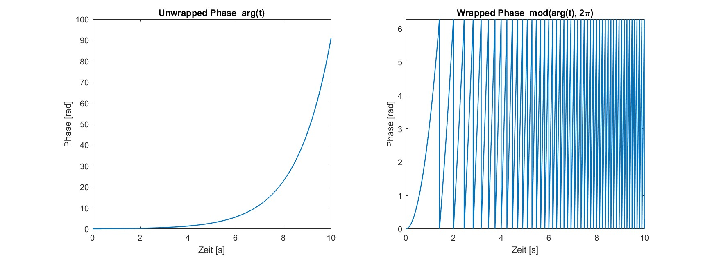

# Chirp-Signal and `sinarg`

A **chirp signal** is a sinusoidal signal whose **frequency varies continuously over time**.  
It is widely used in **system identification** to excite a broad range of frequencies in a single measurement, making it possible to estimate the frequency response $G(j\omega)$ efficiently [1, pp. 84–86].

---

## 1) Mathematical Definition

The instantaneous value of the chirp is defined as
$x(t) = \sin(\text{arg}(t)),$ where the phase argument $\text{arg}(t) = 2\pi \int_0^t f(\tau)\,d\tau$ represents the **instantaneous phase** of the signal. The derivative of this phase yields the **instantaneous frequency** $f(t) = \frac{1}{2\pi}\frac{d(\text{arg}(t))}{dt}$. So `sinarg` expresses a sinusoidal signal with a continuously varying frequency [2, pp. 51–52].

  

In practical implementations such as **Betaflight**, the phase $\text{arg}(t)$ is wrapped using the modulo operation  
$\text{arg}(t) \bmod 2\pi$, so that it resets to 0 whenever a full $\frac{2}{\pi}$ rotation is reached.  
This keeps the numerical values bounded and results in the **sawtooth-shaped** `sinarg` signal often.

---

## 2) Common Frequency Profiles

- **Linear chirp:**  
  The frequency increases linearly over time:  
  $$k = \frac{f_{1}-f_{0}}{T}$$
  $$f(t) = f_0 + k t$$
  $$\text{arg}(t) = 2\pi(f_0 t + \tfrac{1}{2}k t^2)$$

  

  
  

- **Exponential chirp (as used in Betaflight):**  
  The frequency grows exponentially form the starting frequence $f_{0}$ to the ending frequence $f_{1}$ in the time $T$:  
  
  $$f(t) = f_0 \left(\frac{f_1}{f_0}\right)^{t/T}$$
  $$\text{arg}(t) = \frac{2\pi T f_0}{\ln(f_1/f_0)}\left[\left(\frac{f_1}{f_0}\right)^{t/T}-1\right]$$

These functions define the **phase trajectory** `arg(t)` used in simulations and in the `apply_rotfiltfilt` method for time-dependent frequency shifting of chirp signals [1, pp. 85–86].

 

  
  

---

## 3) Purpose and Application

In frequency-domain system identification, chirp signals provide an **energy-efficient broadband excitation**.  
The measured input and output signals can be used to estimate the system’s transfer function over a continuous frequency range.  
Compared to step or random excitation, chirps allow faster and more phase-consistent measurements of linear system dynamics [1, pp. 84–86].

---

## References

[1] R. Pintelon, J. Schoukens, *System Identification: A Frequency Domain Approach*, 2nd ed., IEEE Press, 2012, **pp. 84–86.**  
[2] M. H. Hayes, *Statistical Digital Signal Processing and Modeling*, John Wiley & Sons, 1996, **pp. 51–52.**
