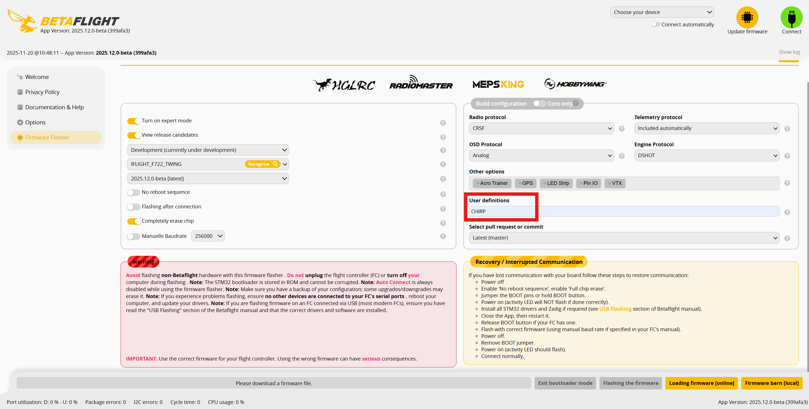

# Implementation of the CHIRP Signal Generator in Betaflight Configurator

The chirp signal generator in Betaflight provides an automated excitation input for analyzing the quadcopter’s dynamic response. It produces a sweep signal whose frequency rises exponentially from a defined starting point to a chosen final value over a preset duration.

This generator outputs a signal that is added directly to currentPidSetpoint inside pid.c. Because of this, the pilot is still in full control over the aircraft during the measurement, and the test can be performed in both `ACRO` and `ANGLE` flight modes.

In order to bring the `CHIRP` signal generator onto your drone, you must include it as a custom define while flashing the Betaflight 2025.12.xx Firmware. You can just type CHIRP into the Field under User Definitions (see picture below). After flashing the Firmware, the `CHIRP` mode appears in the modes tab.

  

It is recommended to assign the `CHIRP` mode to a non-momentary switch. During the first activation, the chirp is applied to the roll axis. After toggling the switch off and on, the signal is applied to the pitch axis and then to the yaw axis. After one full cycle it resets to the roll axis again. This allows repeated analysis of all axes as needed. The mode can be turned off and reactivated at any time.

When `CHIRP` mode is active, the goggles show CHIR as flight-mode label. Once the chirp sequence is complete (after 20 sec), a blinking message CHIRP IS FINISHED is displayed and the flight-mode label changes back to current flight mode.

If you want to test the mode before flight, it is also possible to do this safely on the bench. To prevent damages to your components, lower the PID gains (e.g., P = 10, I = 0, D = 0), and set the values for chirp_amplitude_roll, chirp_amplitude_pitch, and chirp_amplitude_yaw to 10 while the quadcopter is in `ACRO` mode.

---

# 1:1 von michi

## CLI Paramters

|Name|Default value|Comment|
|:---|:------------|:------|
|`chirp_lag_freq_hz`|3 Hz|leadlag1Filter cutoff/pole to shape the excitation signal
|`chirp_lead_freq_hz`|30 Hz|leadlag1Filter cutoff/zero
|`chirp_amplitude_roll`| 230 deg/sec|amplitude roll in degree/second
|`chirp_amplitude_pitch`|230 deg/sec|amplitude pitch in degree/second
|`chirp_amplitude_yaw`|180 deg/sec|amplitude yaw in degree/second
|`chirp_frequency_start_deci_hz`|0.2 Hz / 2 deciHz|start frequency in units of 0.1 hz
|`chirp_frequency_end_deci_hz`|600 Hz / 6000 deciHz|end frequency in units of 0.1 hz
|`chirp_time_seconds`|20 sec|excitation time

## Assumptions for Offline Tuning
- Dynamic Notch filters are tuned (time-variant)
- RPM filters are tuned (time-variant)
- Thrust Linear is tuned (nonlinear)
- Iterm Relax is tuned (nonlinear)
- Feedforward (FF) is disabled (nonlinear)
- Dynamic Damping is disabled (Dmax = D or 0) (nonlinear)
- Debug mode is set to CHIRP (set debug_mode = CHIRP)
- Blackbox high-resolution logging is enabled (set blackbox_high_resolution = ON)
- Let chirp run for the full chirp_time_seconds

## Recommended procedure within one log file per flight
1. Perform two to three throttle sweeps while in `ACRO` mode.
2. Complete at least one full sequence of chirp signal excitation, covering roll, pitch, and yaw axes. It is preferable to
cycle through all axes twice. Whether you choose ACRO or ANGLE mode does not matter. Fly in an open space and try to maintain altitude. Be prepared to adjust the throttle as the chirp generator runs. Aim for a smooth and steady flight during the chirp excitation. Ideally, the quadcopter should maintain a steady position and orientation (appart from the axes thats excited).
3. Conduct some maneuvers to test propwash handling, including 180-degree and 360-degree flips. Enjoy yourself and have fun!

## Data for evaluation
To evaluate your flight data, the log file from the Blackbox is required. This has to be converted to a .csv file. You can do this with the [Betaflight Blackbox Explorer](https://blackbox.betaflight.com/).
