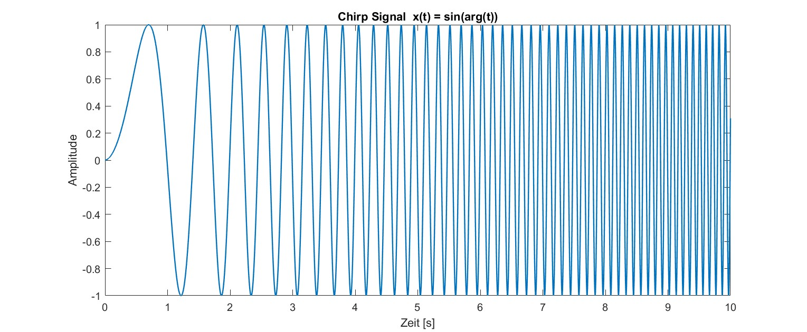
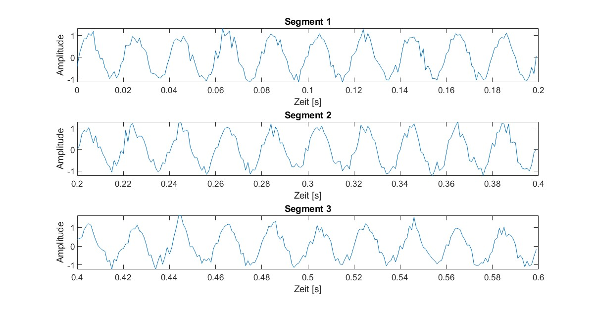
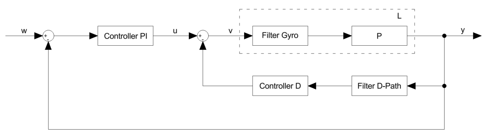

# Betaflight Controller tuning
## Info
```
students:   Yuri Bianchi
            Janick Dort 
            Dario Jurietti

time period: september - december 2025
supervisor: Michael Peter, Prof. Dr. Ruprecht Altenburger
institution: ZHAW School of Engineering
```

---
### Was de Michi will
```
- fokus auf die arbeitsschritte damit verständlich ist was und wie wir es gemacht haben
    - wie wenn wir neu in einer firma anfangen mit einer aufgabe und ein vorarbeiter eine technische doku hinterlassen hat
- keine zu tiefen technischen details, wie herleitungen etc. 
    - dazu der Verweis auf GitHub repo für genauere Informationen
- Übung für BA -> unterteilte Abschnitte für individuelle Bewertung
- 
```
---

# Abstract

This project focuses on the further development of a method for offline tuning of rate controllers for FPV racing drones based on the open-source firmware Betaflight. The quality of rate control is crucial for flight stability, suppression of disturbances such as prop wash, and the agility of the drone. Until now, tuning has mostly been done through time-consuming trial and error.
The aim of the project is to develop a modular, open-source library for offline tuning based on an existing proof of concept. The library will be implemented in MATLAB and a light version in Python and supplemented by detailed Markdown documentation with examples on GitHub. The solution should offer the community a simple way to efficiently optimise drone parameters and thereby improve flight performance.
The results will be published in a public GitHub repository and documented in a report. In addition to software development, the project also includes practical work with FPV drones to validate the methods developed.

# Foreword

This document shows the results of our project thesis, which we worked on during the Fall Semester 2025 at the ZHAW School of Engineering. For us as Systems Engineering students, the Betaflight project was the perfect opportunity to apply complex control theory and signal processing concepts to a real, highly dynamic system. While FPV drones originally started as a hobby for one of our team members, we all became fascinated by the engineering challenge of mathematically modelling and optimising their flight behaviour.

Our motivation was to bridge the gap between academic theory and practical application. We aimed to develop a tool that not only meets engineering standards but also provides real value to the FPV community by replacing subjective tuning with objective data analysis.

This work was carried out at the Institute of Mechatronic Systems (IMS). We would also like to thank our supervisors, Michael Peter and also Prof. Dr. Ruprecht Altenburger, who was our assistant supervisor. They helped us with the technical side of our project and gave us the equipment we needed.

# Table of contents
```


```

# 1. Introduction
First-person view (FPV) racing drones require precise and responsive control to achieve high flight stability, minimize disturbances such as prop wash, and maintain agility during rapid maneuvers. The tuning of rate controllers is key to this performance, as it's what determines how the drone responds to pilot inputs and external influences. Until now, tuning these controllers has relied on iterative trial-and-error methods, a process that is both time-consuming and really hard to do for less experienced pilots.

Betaflight, an open-source firmware widely used in the FPV community, provides a flexible platform for configuring flight controllers. However, despite its popularity, efficient tuning remains a challenge. To address this, our project builds upon an existing proof of concept for offline tuning of rate controllers using flight data and system identification techniques. The goal is to transform this concept into a robust, modular, and open-source library that simplifies the tuning process.

The library will be implemented in `MATLAB and Python`, offering tools for analyzing flight logs, estimating system dynamics, and optimizing controller parameters without requiring repeated flight tests. A documentation is created, which shows how to use the tool and will be published on GitHub to ensure accessibility for the FPV community.

Besides software development, the project involves also building an FPV drone and testing and confirm the effectiveness of the proposed methods. By providing a structured, data-driven approach to tuning, this work aims to improve flight performance and reduce the barriers to achieving optimal control settings for both hobbyists and professionals.

## 1.1 Initial situation
The open-source firmware Betaflight is the most widely used platform for FPV racing drones and is continuously being developed by a large community. The quality of rate control is crucial for flight performance, as it ensures stability, agility and the suppression of disturbances such as prop wash.
Currently, most pilots tune these controller parameters primarily through trial and error, which is time-consuming and difficult for inexperienced pilots. A proof of concept (developed by Michael Peter) already exists that enables offline tuning of rate controllers based on a measurement data model (chirp signal experiment during flight). This concept is currently coded in MATLAB, which is not a widely used Software in the community and therefore rather inaccessible to the open world.

## 1.2 task and objective
The project aims to further develop the existing proof of concept, to make the tool more accessible to the Betaflight community and create an easy-to-use solution to improve the flight performance of FPV drones and replace the time-consuming trial-and-error process of tuning.
- has a clean, modularly expandable structure
- is provided with detailed Markdown how-to documentation and examples for users
- Preparation for futher developments  

# 2. Preparation
## 2.1 Chirp

### 2.1.1 Chirp concept
A chirp is an input signal that sweeps continuously over a defined range (e.g. from a low frequency to a high frequency). This signal excites the system on multiple frequencies in one run and thus lets you observe the frequency response and step response, the foundation of controller tuning.

Mathematically, a chirp signal can be represented as a sinusoidal wave with instantaneous frequency that varies linearly or exponential with time. For more inforation about the mathematical background, please have a look in the document [Chirp Signal](https://github.com/InsaneBroccoli/bf_controller_tuning/blob/PA_final/markdown/Sinarg/Chirp.md).

<p align="center">
  
     Figure xx: Chirp Signal example
</p>

### 2.1.2 Chirp on drone
In the context of tuning a drone's flight controller, an exponential sweep is used. This is due to the dominant low-frequency dynamics, where low frequencies exhibit more predictable responses, allowing the sweep to allocate more time to higher frequencies for better resolution of system behavior. Additionally, multirotor vibration resonances are typically spaced logarithmically, making exponential sweeps more suited for efficient excitation across the frequency range.

The process involves these steps:
  1. Signal Injection: The chirp signal is added to the pilot's stick input. This composite signal becomes the setpoint for the PID controller.
  2. System Response: The drone attempts to follow this rapidly changing setpoint. The motors react, and the drone will oscillate at varying frequencies corresponding to the chirp signal.
  3. Data Logging: While the chirp is active, high-resolution data from the gyroscope and the motor outputs are recorded using Betaflight's Blackbox feature. This data captures how the drone responds to the control inputs at different frequencies.

The recorded log file, containing the input chirp and the corresponding gyroscope output, is then used for offline analysis to determine the frequency response of the system.

### 2.1.3 Chirp programming
The implementation of the chirp signal in Betaflight is straightforward. You call the function chirpInit() and pass:
 - a struct of type chirp_t defined in chirp.h
 - starting frequency
 - end frequency
 - signal length
 - loop-time in microseconds

This initialises the values in the data struct and:
 - converts loop period from microseconds to seconds
 - calculates the number of samples in the signal duration
 - calculates the exponential growth factor
 - precomputes the constants used to get the phase from the frequency evolution
 - calls chirpReset() function

The chirpReset() function sets:
 - internal counter to 0
 - bool isFinished to false
then calls the function chirpResetSignals() to set signal-related fields to 0

Once the chirp is initialised use the chirpUpdate() function once per loop iteration. This function checks:
 - if bool isFinished is true -> return false
 - else if internal counter is equal to the number of samples inside the chirps period -> set bool isFinished true, call chirpResetSignals(), return false
if none of the above is true the ...

# 3. Theory

## 3.1 signal processing

Signal processing in Betaflight Blackbox logs is the process of turning raw flight data into clear, usable information for in-depth analysis. These logs capture detailed data about a flight controller's performance, including stick inputs, gyro data, PID responses, and motor outputs. While the logs themselves can seem complex, tools like the [Betaflight Blackbox Explorer](https://blackbox.betaflight.com/) simplify the data, providing visualizations and insights that make troubleshooting, tuning, and system performance evaluation more accessible.

Preparing this data is a key part of the signal-processing pipeline. It involves cleaning and transforming raw data into a form ready for further analysis. This process begins with filtering. It removes unwanted noise while keeping the signals in their original state. Then the frequency response estimation can be done, which measures how the system reacts to different frequencies. Each of these steps ensures that the data becomes reliable, insightful, and easy to work with during analysis.

### Importing the Data

The first step of any analysis is to load the measurement data properly. Betaflight Blackbox logs have two important parts: the **header** and the **data block**. The header contains important information about how the flight data was recorded, like loop speeds and logging settings. Without this context, the data would not make sense. 

To save time during analysis, the logs are converted from raw CSV files into a faster `.mat` format. This way, you don’t need to reprocess the big log files every time. The signal names (like gyro and motor outputs) are also automatically assigned to their correct data columns. This makes it easy to find and use the signals later. For more details, check the [Dataimport documentation](https://github.com/InsaneBroccoli/bf_controller_tuning/blob/PA_final/markdown/Data/Dataimport.md).

### Handle High-Resolution Data

Betaflight has a **High Resolution Mode** in its logs, where some signals are multiplied with 10 to save space and get rid of nummerical errors during recording. However, these signals must be scaled back down during analysis to get their real values. If this step is skipped, the results will be completely wrong, like seeing incorrect frequencies in a graph or tuning the controller incorrectly.

Important signals like gyro data and control inputs are included in this step. Rescaling their values is critical for all kinds of analysis, from looking at signal behavior to calculating performance. Learn how this works in the [Unscale_high_Resolution_Gain documentation](https://github.com/InsaneBroccoli/bf_controller_tuning/blob/PA_final/markdown/Data/Unscale_high_Resolution_Gain.md).

### Converting Time and Checking Sampling

In a Betaflight log, time is stored as a growing microsecond counter, not as regular seconds. The time between samples isn’t always the same because of hardware limits or system load. This step converts the time data into a simple and consistent format that shows what’s happening at each point.

By checking the time steps between samples, you can find logging errors like dropped frames or slight changes in the real sampling rate. Correctly handling the time information is very important for further analysis, like frequency calculations or tuning the controller. For a clearer explanation, see the [Convert_and_evolution_Time documentation](https://github.com/InsaneBroccoli/bf_controller_tuning/blob/PA_final/markdown/Data/Convert_and_evolution_Time.md).

---

### Application of Rotational Filtering (Apply Rotfiltfilt)

Filtering is an essential step in preparing data for analysis, as it removes unwanted noise while preserving the integrity of the signal. The `Apply Rotfiltfilt` operation applies a zero-phase filter, ensuring that the data's phase relationships remain intact while suppressing specific frequency components like low-frequency drifts or high-frequency noise.

This step uses a forward-backward filtering technique, which processes the data in both forward and reverse directions, effectively cancelling out phase distortions. This methode is especially useful when dealing with chirp signals, as it allows for precise filtering without introducing phase shifts that could alter the signal's characteristics.

Proper application of this technique ensures that the data is clean and reliable for downstream processes. For more insights on how this method works, refer to the full description in the [Apply Rotfiltfilt documentation](https://github.com/InsaneBroccoli/bf_controller_tuning).

### Estimation of Frequency Response

 The `Estimate Frequency Response` function uses advanced techniques to measure and analyze the relationship between a system's input and output signals in the frequency domain. Through that, it reveals how different frequencies are amplified or attenuated by the system, providing crucial insights into its dynamic behavior.

This technique primarily relies on the **Welch Method**, which divides the signal into overlapping segments. By applying a window function to each segment (Hann) and performing spectral averaging, this approach minimizes noise effects and ensures a smoother estimate of the frequency response. It outputs a single-sided, amplitude-calibrated response curve that reveals how each frequency is amplified or attenuated and how the phase shifts occur across the spectrum.

The resulting data is not only accurate but also robust, making it suitable for applications like control system tuning or stability analysis. For a deeper dive into the theoretical principles and implementation steps, consult the detailed [Estimate Frequency Response documentation](https://github.com/InsaneBroccoli/bf_controller_tuning/blob/PA_final/markdown/Frequency_Response/estimate_frequency_response.md).


<p align="center">
  
     Figure xx: Segementation of a Signal
</p>


## 3.2 control system

The control system is a vital component of any flight controller, ensuring stability and precision in drone operation. This section focuses on the steps required to understand, analyze, and tune the controller's behavior. Each part of this process is designed to help refine the system, improving its overall performance and responsiveness.

### Estimating the Transfer Function

To understand how the system reacts to different inputs, the transfer function of the plant must be estimated. This process allows the behavior of the system to be reconstructed from closed-loop data. Without needing to open the control loop, it becomes possible to identify how the system transforms input signals into outputs. This insight is critical for identifying system dynamics and ensuring that the controller parameters match actual system behavior. More details can be explored in the [Estimate Transfer Function documentation](https://github.com/InsaneBroccoli/bf_controller_tuning/blob/PA_final/markdown/Frequency_Response/Estimate_Transferfunction_Plant.md).

### Calculating the Closed Loop

The interaction between the controller and the plant, as well as the response of the closed-loop system as a whole, determines how stable and reliable the control process is. By calculating the closed-loop transfer functions for both inner and outer loops, it is possible to assess sensitivity, disturbance rejection, and overall system stability. These calculations provide an understanding of key controller dynamics and how they influence the system. For a closer look at how this process is carried out, see the document [Calculate Closed Loop documentation](https://github.com/InsaneBroccoli/bf_controller_tuning/blob/PA_final/markdown/Frequency_Response/CalculateClosedLoop.md).

<p align="center">
  
     Figure xx: control system
</p>

### Filters and Controllers

Filters and controllers form the foundation of the control loop. Filters are responsible for removing unwanted noise from sensor signals or motor outputs, while controllers ensure that the flight system remains stable and tracks the desired inputs accurately. The system makes use of various low-pass, notch, and dynamic filters that are designed to optimize the control process. The controllers, such as the PI and D components, are then tuned to achieve the desired balance between reactivity and stability. For further insights, see the [Filters and Controllers documentation](https://github.com/InsaneBroccoli/bf_controller_tuning/blob/PA_final/markdown/Frequency_Response/Filter_and_Controller.md).

### Compensating the I-Term

The integral term in a PID controller addresses long-term errors, ensuring steady corrections over time. However, it can become problematic during quick stick movements, where it may overcorrect and destabilize the system. To avoid this, compensation methods adjust the influence of the I-term based on the situation, suppressing it during rapid changes while allowing it to integrate errors during slower movements. This approach helps maintain both precision and responsiveness. Have a look at [Compensate I-Term documentation](https://github.com/InsaneBroccoli/bf_controller_tuning/blob/PA_final/markdown/Frequency_Response/Compensate_Iterm.md) to see how we added compensation to the calculation.

## 3.3 Evaluation

Evaluation is a critical part of understanding and improving the behavior of the control system. This section outlines key analytical steps, such as analyzing time-domain responses and interpreting frequency-domain data to assess system dynamics comprehensively.

### Step Response

The step response provides a direct view of how the system reacts to sudden changes in the input signal. By transforming the closed-loop transfer function from the frequency domain into the time domain, the transient behavior of the control loop can be observed. Key performance indicators like rise time, overshoot, settling time, and steady-state error are derived to evaluate system stability and responsiveness. The calculations rely on tools that perform inverse Fourier transforms of frequency response data to estimate the system’s step response curve. This curve allows engineers to identify and correct underdamped or poorly tuned dynamics. More details can be found in the [Step Response documentation](https://github.com/InsaneBroccoli/bf_controller_tuning/blob/PA_final/markdown/Frequency_Response/Step_response.md).

### Spectra Analysis

Spectral analysis examines how the system reacts to various input frequencies, providing crucial insights into its dynamic behavior. The analysis breaks down complex signals into their frequency components using algorithms like Welch’s method. Overlapping signal segments, combined with windowing techniques such as the Hann window, help ensure smoother, statistically reliable estimation of power spectra. This frequency-domain perspective highlights resonances, noise characteristics, and the effectiveness of applied filters. The [Spectra Analysis documentation](https://github.com/InsaneBroccoli/bf_controller_tuning/blob/PA_final/markdown/Spectrum_Spectogram/Spectra_Analysis.md) describes the steps in detail.

### Spectrum Analysis

Spectrum analysis extends the ideas of spectral analysis by providing a richer, multi-dimensional understanding of the signal’s frequency content over time or in our case thrust. By grouping FFT segments into bins across an additional axis, such as throttle or angle, this technique maps the power spectrum as a function of both frequency and a chosen variable. This multi-dimensional approach is particularly useful in applications that require an understanding of how system dynamics evolve during flight. Relevant methodologies and results are documented in the [Spectrum Analysis section](https://github.com/InsaneBroccoli/bf_controller_tuning/blob/PA_final/markdown/Spectrum_Spectogram/Spectrum_Analysis.md).

# 4. Working steps and Problems

## 4.1 Simulations

At the beging of our thesis, we started to create simulations. We used these simulations to deepen our understandig of the existing code and to understand the used methods. The simulations were crucial, but als very time intensive. They formed the basis for all later analysis steps and helped us understanding the existing functions before we used them further.

### 4.1.1 Simulation of Betaflight Controller Order

For analysis and for better understanding of the Betaflight control system, we recreated the complete control structure in MATLAB. You will find the corresponding script in the attachments. In the simulation, we attempted to reproduce the step response of the recorded data by using the same PID parameters and filter settings as in the real system.
The different filter where created according to the documentation [Filter and Controller](../Frequency_Response/Filter_and_Controller.md). We implemented the filters both continuously and discretely, so that we could compare the two types. The PI- and D-Controller were built in the same way.
For the transfer function of the plant we used a simplified version out of PT `??` elements and dead time, based on the approaches form the documentation [Calculation Closed Loop](../Frequency_Response/CalculateClosedLoop.md).
In addition to the MATLAB code, we created a Simulink model, in which we tested the step response of our simulation of the Betaflight control system. The simulated answer got close to the step response of the real drone. For us, this was the confirmation, that we got the controller order correct.

### 4.1.2 Simulation PID Controller

To deepen our understanding of the different controller components, we created an additional MATLAB script. It allowed us to combine different controller types with simple plant models. In the program you can switch between P, I, PI, PD and PID controllers, and between basic plant types. Through this, we were able to observe how each controller component influences the overall system behaviour.
The script calculates the open and closed loop of the chosen settings and generates Bode plots, Nyquist diagrams and step responses. This helped us to understand and visualize the effect of each component. Trough that, our overall understanding of contoller behaviour significantly improved.

### 4.1.3 Simulation Frequency Response

To analyse the frequency response of a system based on input and output data, we created an additional simulation. In this simulation we created a chirp signal on which we added noise for a more realisic measurement condition. Using these signals, we implemented different methods to estimate the system’s transfer function.
First, we calculated a basic frequency response using the plain Fast Fourier Transformation (FFT). That got us a good benchmark. After that, we applied different signal processing methods. First we used the Welch method to improve the estimation by averaging over overlapping segments. The implementation of the Welch Frequency Response Function (FRF) follows the theory described in the documentation [Estimate Frequency Response](../Frequency_Response/estimate_frequency_response.md). This allowed us to compare the plain FFT approach with the more robust Welch estimator.
In the next step we implemented a rotated-signal approach, where the chirp is demodulated to baseband before filtering. For this part we used the zero-phase filtering method apply_rotfiltfilt, as described in the documentation [Apply Rotfiltfilt](../Frequency_Response/ApplyRotfiltfilt.md). After that we compared the orignal bode plot to the signal processed one `??`, to see how the rotation technique improves the noise robustness.
Overall, this script helped us understand how noise affects the estimated transfer function and how we can increase the robustness of the signals.

### 4.1.4 Simulation Spectra

To better understand the different components use to create a meaningful spectrum, we developed a simulation based on the system used in the given code. In this script we generated a noisy sinusoidal input signal out of which we created different spectra. In one case we applied a window function and in the other we did not use any window. By splitting the signal into several overlapping segments, we were able to observe how averaging across segments reduces noise and stabilises the resulting spectrum. The implementation is described in detail in the document [Spectra Analysis](../Spectrum_Spectogram/Spectra_Analysis.md).
Overall, this exercise helped us understand how windowing, overlap and segment length affect the spectral estimation. Also how these methods can increase robustness and reduce spectral leakage.

### 4.1.5 Simulation Spectogram

For better understandig of the analysis how the frequency content of the excitation signal changes with both time and thrust, we developed an further MATLAB simulation. In this script, we generated a noisy sinusoidal input signal and a slowly varying thrust signal. The input signal is then split up in different segments and windowed with a Hann window. After this the signal is transformad using the FFT in order to obtain a time-frequency representation.
At first, we arranged the segment spectra along the time axis and in e second step, along the thrust levels. So we got two spectrograms, one is showing the amplitude over frequency and time, and the other one is showing us the amplitude over frequency and thrust. Through this visualisation, we can identify the dominant frequency components depending on thrust. The underlying method is described in detail in the document [Spectrogram Analysis](../Spectrum_Spectogram/Spectogram_Analysis.md).

## 4.2 Building an FPV drone
Besides the understanding of the code and further developing the proof of concept, building a drone and set it up correctly bridges the gap between the digital domain, where algorithms and simulations are developed and the physical reality of drone operation. By getting in touch with the hardware, it is easier for us to understand what practical challenges exist for pilots and the community.

<p align="center">
  
</p>

Therefore a three inch FPV drone was built from the ground up. 
This work included:
- creating schemes to see which connections were required
- soldering all the components as the motors, receiver, video system, logger and gps module to the flight controller
- attaching everything to the frame, so that nothing generates unnecessary oscillations during flight
- double check all soldering connections and screws
- setting everything up in betaflight
- testfly the drone

The biggest challange was to achieve good soldering connecions `...`


## 4.3 Tuning an FPV drone
As part of understanding the workflow we tuned an FPV drone by ourselves. The goal was to adjust the PID parameters so that we achieve a fast rising step response without overshoot, a lower complianace than before and a rounded shaped Sensitivity. Also to mention is, that the axes roll and pitch should be tuned as simmilar to eachother as possible. This is because you want the drone to maintain a consistent and predictable response, so roll and pitch behave similarly for smoother control and a balanced flight experience.

Initially, we deliberately applied a poor tuning configuration to observe its effects. During the first field test with this setup, it quickly became apparent that the tuning was excessively poor. The drone began oscillating aggressively and climbed rapidly. As the drone was out of control, the kill switch had to be activated, resulting in a crash that broke one of the four arms. Fortunately, the damage was minor and repaired quickly.

After this incident, we decided not to repeat flights with intentionally bad tuning. Instead, we continued using the default Betaflight parameters as a baseline. `With these the drone flies reliably.` However, during demanding maneuvers such as flips or propwash manouvers, it becomes evident that there is room for improvement in terms of stability and responsiveness.

The tuning process was carried out on a larger 6-inch FPV drone provided by one of the team members. The drone was freshly flashed with Betaflight v12, meaning all filters and settings were at factory defaults. Achieving an optimal tune required several attempts due to challenges with filter adjustments and occasional logging issues. Nevertheless, the drone was successfully tuned, and the improvement was noticeable. During propwash manoeuvres, the drone remained significantly more stable, and flips were executed with greater precision at the stop.

Our tuning objective was to achieve a fast step response without overshoot, while maintaining good compliance and sensitivity. It is important to note that there is no universally “perfect” tune. Settings depend heavily on pilot preferences. Racing pilots for example maybe want more responsiveness for competitive performance, whereas freestyle pilots want smoothness and flight feel. 

Since none of our team members are professional pilots, we focused on achieving robustness and a step response without overshoot. This tuning approach is probably somewhere between what a racing pilot and a freestyle pilot would prefer. Robustness in this context is important for practical scenarios, such as when a propeller is slightly bent, the battery sits slightly off center or when an additional component like a camera is mounted on the drone.

## 4.4 Decode


## 4.5 Code Structure and programming style
From the start of the project, we recognized that a clear and maintainable code structure would be essential. The initial proof-of-concept code already contained a rough separation into topics such as data I/O and step response, but everything was packed into a single file, making it difficult to navigate. Our first step was to comment out the proof-of-concept code and reorganize it into thematic sections. This was the foundation for a more organized layoutand we came to an initial directory structure:

```
bf_controller_tuning/
│
├── main.m
├── data_io/
│   ├── load_data.m
│   ├── extract_header_information.m
│   └── preprocess_data.m
├── flight_parameters/
│   ├── get_pid_parameters.m
│   ├── scale_pid_parameters.m
│   └── print_parameters.m
├── spectrogram/
│   ├── calculate_spectrogram.m
│   ├── plot_spectrogram.m
│   └── show_spectrogram.m
├── spectra/
│   ├── estimate_spectra.m
│   ├── plot_spectra.m
│   └── show_spectra.m
├── frequency_response/
│   ├── estimate_frequency_response.m
│   ├── plot_bode.m
│   └── show_frequency_response.m
├── controller_analysis/
│   ├── calculate_closed_loop.m
│   ├── calculate_step_response.m
│   └── show_controller_analysis.m
└── utils/
    ├── apply_rotfiltfilt.m
    ├── downsample_frd.m
    └── get_my_colors.m
```
This draft was never intended to be final. Rather, it served as an initial attempt to bring clarity and separation between different functional areas.

### 4.5.1 OOP vs. Functional Approach
At this stage, we discussed whether to implement the entire project using object-oriented programming (OOP) or stick to a modular, function-based approach. Initially, we considered OOP as a challenge, since most of us were not very experienced with it. We started writing some components as classes, but quickly realized that only one team member really was comfortable with OOP, while the others struggled. This made us reconsider.
Our conclusion was to use OOP selectively—only for parts that benefit from reuse and encapsulation, such as data loading and plotting, while keeping the rest function-based for simplicity. This hybrid approach allowed us to maintain flexibility without overcomplicating the design.

After several attempts, we agreed on the following principles:

- A main script (main.m) for user input, figure selection, filter settings, and PID tuning
- A core class to handle all calculations (essentially the logic from the proof of concept, but without plotting)
- A plot utilities class to centralize all plotting functions for consistency

Existing library functions from the proof of concept were reused without modification. The thematic grouping included:

```
bf_controller_tuning/
│
├── class/
│     ├─ main_class.m
│     └── plot_utils.m
├── lib/
│     ├─ apply_rotfiltfilt.m
│     ├─ calculate_closed_loop.m
│     ├─ calculate_controllers.m
│     ├─ calculate_step_response_from_frd.m
│     ├─ calculate_transfer_functions.m
│     ├─ downsample_frd.m
│     ├─ estimate_frequency_response.m
│     ├─ estimate_spectra.m
│     ├─ estimate_spectrogram.m
│     ├─ expand_multiple_figure_nr.m
│     ├─ extract_header_information.m
│     ├─ get_chirp_signals.m
│     ├─ get_fcut_from_D_and_fcenter.m
│     ├─ get_fcut_from_exp.m
│     ├─ get_filter.m
│     ├─ get_ind_eval.m
│     ├─ get_my_colors.m
│     ├─ get_notch_Q.m
│     ├─ get_pid_scale.m
│     └─ get_switch_case_text_from_para.m
├── logs/
└── main.m
```
This structure worked well and kept the main script simple for the user. However, after a review meeting, our instructor suggested further modularization. The reason: we had created a “god class,” which limited flexibility. For example, if someone wanted to use the tool only for plotting spectrograms without any drone-specific logic, the current design made that difficult. Also the program was slow. All calculations were made, everytime the user changed something. We wanted to improve the speed in only doing these calculations again, which are relevant on that specific user input change. 

### 4.5.2 Final Structure Concept
Out of this, we decided to split up this god class into three classes. The `flight_analyzer` class handles **frequency domain analysis and vibration characterization**. Its core responsibility is performing spectral analysis on flight log data to identify resonance frequencies and assess filter effectiveness. It computes power spectral density of gyro signals (both filtered and unfiltered) and generates spectrograms showing how vibration frequencies vary with throttle levels across all three axes (roll, pitch, yaw). This analysis is essential for identifying noise sources, evaluating filtering strategies, and optimizing drone stability during tuning. The `flight_data` class is responsible for **loading, parsing, and managing flight log data**. It provides methods to extract relevant information from Blackbox logs, such as gyro and motor data, and prepares this data for analysis. The `gyro_ctrl_tuning` class focuses on **tuning the PID controllers** for the drone's flight. It uses the results from the frequency response and spectral analysis to adjust the PID parameters, aiming to optimize the drone's flight characteristics. The `plot_utils` class remains responsible for **visualization and graphical representation** of all analysis results. Unlike the previous approach, this class is now more flexible and reusable. It can be used independently to generate plots from pre-calculated data, making it suitable for users who only want to visualize spectrograms, frequency responses, or step responses without running the full analysis pipeline. This modularity allows the plotting functionality to be easily adapted for different visualization needs and integrated into other workflows.

This approach still holds thematic sections, but is more accessible to use only specific parts of the tool. 

```
bf_controller_tuning/
│
├── class/
│     ├─ flight_analyzer.m
│     ├─ flight_data.m
│     ├─ gyro_ctrl_tuning.m
│     └── plot_utils.m
├── lib/
│     ├─ apply_rotfiltfilt.m
│     ├─ calculate_closed_loop.m
│     ├─ calculate_controllers.m
│     ├─ calculate_step_response_from_frd.m
│     ├─ calculate_transfer_functions.m
│     ├─ downsample_frd.m
│     ├─ estimate_frequency_response.m
│     ├─ estimate_spectra.m
│     ├─ estimate_spectrogram.m
│     ├─ expand_multiple_figure_nr.m
│     ├─ extract_header_information.m
│     ├─ get_chirp_signals.m
│     ├─ get_fcut_from_D_and_fcenter.m
│     ├─ get_fcut_from_exp.m
│     ├─ get_filter.m
│     ├─ get_ind_eval.m
│     ├─ get_my_colors.m
│     ├─ get_notch_Q.m
│     ├─ get_pid_scale.m
│     └─ get_switch_case_text_from_para.m
├── logs/
└── main.m
```

## 4.6 Python in MATLAB
The code has been divided into logically related sections in order to clearly separate topics such as spectral analysis or frequency response estimation and calculation. Dividing the code into thematic sections helps to improve readability and clearly present the individual topics. 

As we thaught the MATLAB code was structured good enough, we wanted to start with the conversion to python. First we considered starting from scratch and rewrite the whole code, but it was made clear, that this is hard to test within the rewriting process. The idea then was to convert all the MATLAB functions in the `\lib` to python first and then call these rewritten python functions from the `gyro_ctrl_tuning` class in MATLAB. The advantage of doing so, gave us the ablity to test every function, weather they were converted correctly or not. In a second step, the `gyro_ctrl_tuning` and lastly the `plot_utils` class would have been converted to python. Unfortunately we ran into the problem, `that in python FRD objects do not exist the same way as they do in MATLAB`. Exept you use the control toolbox. 

This led us to write helper functions, which converted the MATLAB FRD objects into NumPy-arrays using the numpy library. One array holding the frequencies and one the response data. The same process had to be done in the opposite direction, from python to MATLAB. 

```
It quickly became clear, that this was a good idea, but not the most practical way. 

This is because later in python, these helperfunctions are not necessary anymore, as we would hold this data in two arrays anyway. 

As Dario started an easy python version of the tool, the plan was to just build up on this.

```

# 5. Results

The project delivered in different practical and technical result. First we successfully reconstructed 


# 6. Discussion and next steps
## 6.1 Discussion

Overall, the work in the last 14 weeks mainly served as a foundation for the future work at the project during our Bachlor thesis rather than a finished end product. We were able to lay the groundwork for further developments. For example, we newly structured the code, which allows us to make addtions and upgrades in the code faster and clearer. But more importantly, we were able to lern much about the behaviour of the Betaflight controll system and how we have to face challenges in it. Dario and Janick also lerned how a drone flys and how to build an FPV drone. This experience helped us to better relate the abstract analysis results and behaviour in the air.
Additionally to this, we deepened our understanding how advanced signal-processing methode and more complex controll loops working. We achived this through a series of simulations which made it us easier to connect the theorie to the measuered data of real flights. Also, we improved our skills in object oriented programming and how to structer a big code. We also were able to get our first experiene in using control-engineering in Python, even though the Python implementation is not finished yet. All of this will help us to develope new features quickly and with high quality in our Bachlor thesis. 

## 6.2 Next steps
This project is being continued and further developed as part of a bachelor's thesis. This mainly includes converting the code to python completely to make the PID tuning tool more accessible to the comunity and develop and implement a new function for position hold for example. 

The goal of this is to make the tool good enough, that it can implemented directly into the betaflight configurator or blackbox explorer

## 6.3 Conclusion

During this project we successfully developed the foundation of a modular and easy to use tool for offline gyro tuning of Betaflight FPV drones. Throught the works on the project, we gained a solid understanding of the gyro control struction and the behaviour of the Betaflight filters. We also lerned, how different methods works to exclude noise works and how we have to use it. Building and flying also helped us to bridging the gap between theore calculation and the real world behaviour of the drone during the flights.
On the software side, we lerned to handle such a big project. We restructert the existing code, that will allow us to develop further features on this basis. Through that we were able to deepen our skills in object oriented programming. We were also able to recreate key functions to python, such as calculate closed loop or transfer fuction estimation. While the full transfer from MATLAB to Python is ongoing, we have a clear roadmap and enough tecnical knowledge.

Overall, even the transfer form MATLAB to Python is not finished yet, the project achieved its main goal. We estabilished a robust starting point for future developments, both for our bachelor thesis and for a possible integration into the Betaflight tools for the FPV community.

# 7. Directories
